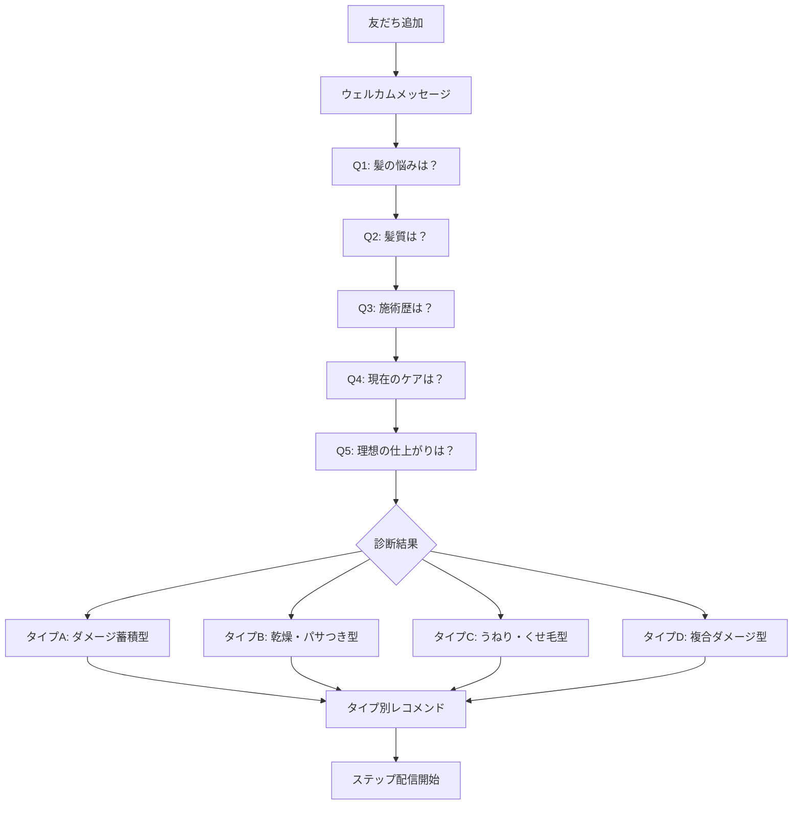

# LINE髪質診断チャットボット フロー設計

年商1億円マーケティング戦略 第5章に基づく

---

## 目的

LINE公式アカウントを通じて「髪質診断」を提供し、
**診断 → 教育 → 処方（=商品提案）** の流れで CVR 15% を実現する。

> 核心：「売り込み」ではなく「処方された」という認識を生む

---

## KPI

| 指標 | 目標 |
|------|------|
| 月間LINE友だち追加 | 100件以上 |
| 診断完了率 | 80%以上 |
| 診断→購入CVR | **15%以上** |
| ブロック率 | 10%以下 |

---

## 友だち追加の導線

| 入口 | 設置場所 | CTA文言 |
|------|---------|---------|
| 広告LP（lp01） | 3択CTAの3番目 | 「🔍 まずは無料で髪質診断（LINE）」 |
| ブランドLP | フッター付近に追加 | 「あなたに合うケアを診断」 |
| Instagram Bio | プロフィールリンク | 「30秒で髪質診断 → LINE」 |
| Instagram Stories | スワイプリンク | 「あなたの髪質タイプは？」 |

---

## 診断フロー（全5問 → 結果 → ステップ配信）



---

## 質問設計

### ウェルカムメッセージ
```
はじめまして！selfの髪質診断へようこそ ✨

30秒で5つの質問に答えるだけで、
あなたの髪質タイプと最適なケア方法がわかります。

さっそく始めましょう！
```

### Q1: 一番気になる髪の悩みは？（リッチメニュー or カルーセル）
- A. パサつき・乾燥
- B. うねり・くせ毛
- C. カラー/パーマのダメージ
- D. 広がり・まとまらない

### Q2: 髪質はどちらに近いですか？
- A. 細くて柔らかい（猫っ毛）
- B. 普通〜やや太い
- C. 太くて硬い（剛毛）

### Q3: 美容室での施術歴は？
- A. カラーのみ
- B. カラー + パーマ
- C. 縮毛矯正あり
- D. ブリーチ歴あり

### Q4: 現在のヘアケアは？
- A. ドラッグストアのシャンプーのみ
- B. サロン専売シャンプーを使用中
- C. トリートメントやオイルも使用
- D. 特にこだわりなし

### Q5: 理想の仕上がりは？
- A. サラサラでまとまる髪
- B. ツヤツヤで潤いのある髪
- C. ふんわり軽い髪
- D. なめらかで落ち着いた髪

---

## 診断結果パターン

### タイプA：ダメージ蓄積型
```
🔬 あなたの髪質タイプ

【ダメージ蓄積型】

カラーやパーマによる蓄積ダメージが
髪の内部構造に影響している状態です。

🎯 あなたへのおすすめケア
━━━━━━━━━━━━━━━
✅ ペリセアによる内部補修（約1分で浸透）
✅ 美容液泡パック（週1〜2回）
✅ エルカラクトンで熱ダメージ予防

💡 selfシャンプー＆トリートメントセット
がピッタリです。

▶ 特別価格で試してみる
[公式ECリンク + UTM]
```

### タイプB：乾燥・パサつき型
（保湿成分を強調したバージョン）

### タイプC：うねり・くせ毛型
（エルカラクトンの熱補修を強調）

### タイプD：複合ダメージ型
（セット使用の相乗効果を強調）

---

## ステップ配信シナリオ（診断後）

| 日数 | 配信内容 | 目的 |
|------|---------|------|
| 0日目 | 診断結果 + 商品レコメンド | 初回接触・処方感 |
| 1日目 | 「正しいシャンプーの仕方」教育コンテンツ | 信頼構築 |
| 3日目 | 「なぜサロン専売品質が自宅で必要？」 | 価値教育 |
| 5日目 | お客様の声（同じ悩みを持つ方のビフォア/アフター） | 社会的証明 |
| 7日目 | 開発者・東えりかのストーリー | 感情的つながり |
| 10日目 | **限定オファー**（初回購入特典があれば） | CV促進 |
| 14日目 | 「まだ迷っている方へ」最終案内 | ラストプッシュ |

---

## LINE公式アカウント開設チェックリスト

- [ ] LINE for Business でアカウント作成
- [ ] プロフィール設定（ロゴ、説明文、あいさつメッセージ）
- [ ] Lステップ or エルメ の契約・連携
- [ ] 髪質診断フローの構築（上記5問＋4タイプ結果）
- [ ] ステップ配信の設定（7回配信シナリオ）
- [ ] リッチメニューのデザイン・設定
- [ ] LP01のLINEボタンにURLを設定（現在 `href="#"` → 実URLに変更）
- [ ] Instagram BioにLINEリンク追加
- [ ] テスト送信・フロー確認
